# LangGraph Workflow Flow - Current Implementation

```mermaid
flowchart TD
    Start([Webhook Message<br/>from GHL]) --> Intelligence[Intelligence Node<br/>Spanish Pattern Extraction<br/>Score 1-10]
    
    Intelligence --> GHLUpdate[GHL Update Node<br/>Save Score & Data<br/>to Custom Fields]
    
    GHLUpdate --> Supervisor{Supervisor Node<br/>Check Qualification}
    
    Supervisor --> CheckQual{Has ALL:<br/>✓ Name<br/>✓ Email<br/>✓ Budget $300+?}
    
    CheckQual -->|Score 6+<br/>ALL Requirements| RouteToSofia[Route to Sofia]
    CheckQual -->|Score 5-7<br/>OR Missing Requirements| RouteToCarlos[Route to Carlos]
    CheckQual -->|Score 1-4| RouteToMaria[Route to Maria]
    
    RouteToSofia --> Sofia[🔥 Sofia Agent<br/>Appointment Setter]
    RouteToCarlos --> Carlos[🟡 Carlos Agent<br/>Budget Qualifier]
    RouteToMaria --> Maria[❄️ Maria Agent<br/>Support]
    
    Sofia --> SofiaCheck{Sofia Validates:<br/>Name? Email?<br/>Budget $300+?}
    
    SofiaCheck -->|All Present| BookAppt[✅ Book Appointment<br/>Check Calendar<br/>Create Meeting]
    SofiaCheck -->|Missing| AskForInfo[Ask for Missing:<br/>'Necesito tu email'<br/>'¿$300/mes funciona?']
    
    Carlos --> QualifyBudget["Carlos Asks:<br/>'Trabajo con presupuestos<br/>desde $300/mes,<br/>¿te funciona?'"]
    
    QualifyBudget -->|'Sí'/'Yes'| UpdateBudget[Update State:<br/>budget_confirmed = true<br/>Transfer to Sofia]
    QualifyBudget -->|'No'| PoliteClose["'Cuando estés listo<br/>para invertir, aquí estaré'"]
    
    Maria --> BasicSupport[Gather Information<br/>Answer Questions<br/>Build Rapport]
    
    BookAppt --> Responder
    AskForInfo --> Responder
    UpdateBudget --> BackToSupervisor
    PoliteClose --> Responder
    BasicSupport --> Responder
    
    BackToSupervisor -->|With Budget Confirmed| Supervisor
    
    Responder[Responder Agent<br/>Send to GHL] --> End([End])
    
    %% Styling
    style Sofia fill:#ff6b6b,stroke:#c92a2a,color:#fff
    style Carlos fill:#ffd43b,stroke:#fab005,color:#000
    style Maria fill:#74c0fc,stroke:#339af0,color:#000
    style Intelligence fill:#9775fa,stroke:#7950f2,color:#fff
    style GHLUpdate fill:#51cf66,stroke:#2f9e44,color:#fff
    style Supervisor fill:#ff8787,stroke:#fa5252,color:#fff
    style BookAppt fill:#51cf66,stroke:#2f9e44,color:#fff
    style Responder fill:#15aabf,stroke:#0c8599,color:#fff
```



## Key Components:

### 1. **Intelligence Layer** (Deterministic)
```python
# Spanish Pattern Extraction:
- Names: "mi nombre es", "me llamo", "soy"
- Business: "tengo un/una", "mi negocio"
- Budget: "como unos $300", "aproximadamente"
- Scoring: 1-10 (never decreases)
```

### 2. **Supervisor** (Router)
```python
# Qualification Check:
if has_name AND has_email AND has_budget_300:
    if score >= 6: → Sofia
else:
    if score >= 5: → Carlos
    else: → Maria
```

### 3. **Agent Responsibilities**

#### Sofia (Hot Leads - Appointments)
- **Requirement**: Must have ALL 3 (name, email, budget)
- **Actions**: Check calendar, book appointment
- **Scripts**: "Necesito tu email para el link"

#### Carlos (Warm Leads - Qualification)
- **Focus**: Qualify budget at $300+
- **Script**: "Trabajo con presupuestos desde $300/mes"
- **Transfer**: If "sí" → Sofia

#### Maria (Cold Leads - Support)
- **Focus**: Information gathering
- **Actions**: Build rapport, educate

### 4. **Responder Agent**
- Collects all AI messages
- Sends to GHL via API
- Ensures delivery

## State Management:

```typescript
ConversationState {
    // Core Fields
    messages: Message[]
    contact_id: string
    lead_score: number (1-10)
    
    // Extracted Data
    extracted_data: {
        name?: string
        email?: string
        business_type?: string
        budget?: string
        goal?: string
    }
    
    // Qualification Tracking
    budget_confirmed: boolean
    response_sent: boolean
    interaction_count: number (max 3)
    should_end: boolean
}
```

## Differences from n8n:

1. **Parallel Processing**: LangGraph can run agents concurrently
2. **State Management**: Centralized state vs message passing
3. **Responder Pattern**: Dedicated agent for message delivery
4. **Max 3 Interactions**: Prevents expensive loops

## Critical Rules Enforced:

1. ✅ No appointments without name + email + budget $300+
2. ✅ Score never decreases (persistence)
3. ✅ All data saved to GHL custom fields
4. ✅ Maximum 3 agent interactions per conversation
5. ✅ Responder ensures message delivery