# N8N Workflow Flow - Main Outlet Media

```mermaid
flowchart TD
    Start([Webhook Received]) --> GetContact[Get Contact from GHL]
    
    GetContact --> EditFields[Edit Fields<br/>Extract Custom Fields]
    
    EditFields --> CheckStop{Message contains<br/>'stop'?}
    
    CheckStop -->|Yes| SendStop[Send Stop Confirmation]
    CheckStop -->|No| CheckMedia{Has Media?}
    
    CheckMedia -->|Yes| MediaResponse[Media Not Supported Response]
    CheckMedia -->|No| CheckBatch{Batch Messages?}
    
    CheckBatch -->|Try Redis| RedisOp[Get Queued Messages<br/>from Redis]
    CheckBatch -->|Redis Fails| CurrentMsg[Use Current Message Only]
    
    RedisOp --> ParseMessages[Parse & Sort Messages<br/>Last 20 messages]
    CurrentMsg --> ParseMessages
    
    ParseMessages --> FullContext[Build Full Context<br/>- Previous Score<br/>- Name/Email/Business<br/>- Budget/Goal<br/>- Conversation History]
    
    FullContext --> AIAnalysis[AI Lead Analysis<br/>Score 1-10]
    
    AIAnalysis --> ParseAI[Parse AI Output<br/>Extract structured data]
    
    ParseAI --> EnhanceData{Enhance Extracted Data}
    
    EnhanceData --> CheckBudget{Budget Confirmation?<br/>'si' after $300 question}
    EnhanceData --> ExtractName[Extract Spanish Name Patterns<br/>'soy/me llamo/mi nombre es']
    EnhanceData --> ExtractBusiness[Extract Business Type<br/>'tengo un/una']
    EnhanceData --> ExtractEmail[Extract Email Pattern]
    
    CheckBudget -->|Yes| SetBudget300[Set Budget: 300+<br/>Score: min 6]
    CheckBudget -->|No| KeepCurrent[Keep Current Budget]
    
    ExtractName --> ScoreCalc
    ExtractBusiness --> ScoreCalc
    ExtractEmail --> ScoreCalc
    SetBudget300 --> ScoreCalc
    KeepCurrent --> ScoreCalc
    
    ScoreCalc[Calculate Score<br/>Never Decrease] --> UpdateGHL[Update GHL Custom Fields<br/>- Score<br/>- Intent<br/>- Business Type<br/>- Budget<br/>- Name]
    
    UpdateGHL --> RouteDecision{Route by Score<br/>& Qualification}
    
    RouteDecision -->|Score 8-10<br/>Has Email<br/>Has Budget $300+| HotAgent[🔥 HOT AGENT<br/>Sofia - Appointments]
    RouteDecision -->|Score 5-7<br/>OR Missing Budget| WarmAgent[🟡 WARM AGENT<br/>Carlos - Qualification]
    RouteDecision -->|Score 1-4| ColdAgent[❄️ COLD AGENT<br/>Maria - Support]
    
    HotAgent --> CheckQual{Has ALL:<br/>✓ Name<br/>✓ Email<br/>✓ Budget $300+?}
    
    CheckQual -->|Yes| BookAppt[Check Calendar<br/>Book Appointment<br/>Send Confirmation]
    CheckQual -->|No| AskMissing[Ask for Missing Info]
    
    WarmAgent --> QualifyBudget[Ask: 'Trabajo con<br/>presupuestos desde<br/>$300/mes, ¿te funciona?']
    
    QualifyBudget -->|Si/Yes| TransferSofia[Transfer to Sofia]
    QualifyBudget -->|No| PoliteClose[Polite Closure]
    
    ColdAgent --> GatherInfo[Gather Basic Info<br/>Educate on Services]
    
    BookAppt --> SendResponse[Send WhatsApp Response]
    AskMissing --> SendResponse
    TransferSofia --> SendResponse
    PoliteClose --> SendResponse
    GatherInfo --> SendResponse
    
    SendResponse --> UpdateMemory[Update Redis Memory<br/>Save Conversation]
    
    UpdateMemory --> End([End])

    style HotAgent fill:#ff6b6b,stroke:#c92a2a,color:#fff
    style WarmAgent fill:#ffd43b,stroke:#fab005,color:#000
    style ColdAgent fill:#74c0fc,stroke:#339af0,color:#000
    style CheckQual fill:#ff8787,stroke:#fa5252,color:#fff
    style SetBudget300 fill:#51cf66,stroke:#2f9e44,color:#fff
```



## Key Decision Points:

### 1. **Lead Scoring (1-10)**
- Score based on extracted data
- Never decreases (persistence rule)
- Budget confirmation boosts to minimum 6

### 2. **Qualification Check**
```
Required for Appointments:
✓ Name (from Spanish patterns)
✓ Email (for Google Meet)
✓ Budget $300+ (must be confirmed)
```

### 3. **Agent Routing**
- **HOT (8-10)**: Sofia - But ONLY if qualified
- **WARM (5-7)**: Carlos - To qualify budget
- **COLD (1-4)**: Maria - Basic support

### 4. **Budget Detection Patterns**
```javascript
// Approximate amounts in Spanish:
"como unos 300" → budget: "300"
"aproximadamente 300" → budget: "300"
"si" (after $300 question) → budget: "300+"
```

### 5. **Critical Rules**
- NEVER book without all 3 requirements
- NEVER decrease lead score
- ALWAYS persist data to GHL
- ALWAYS check existing appointments first