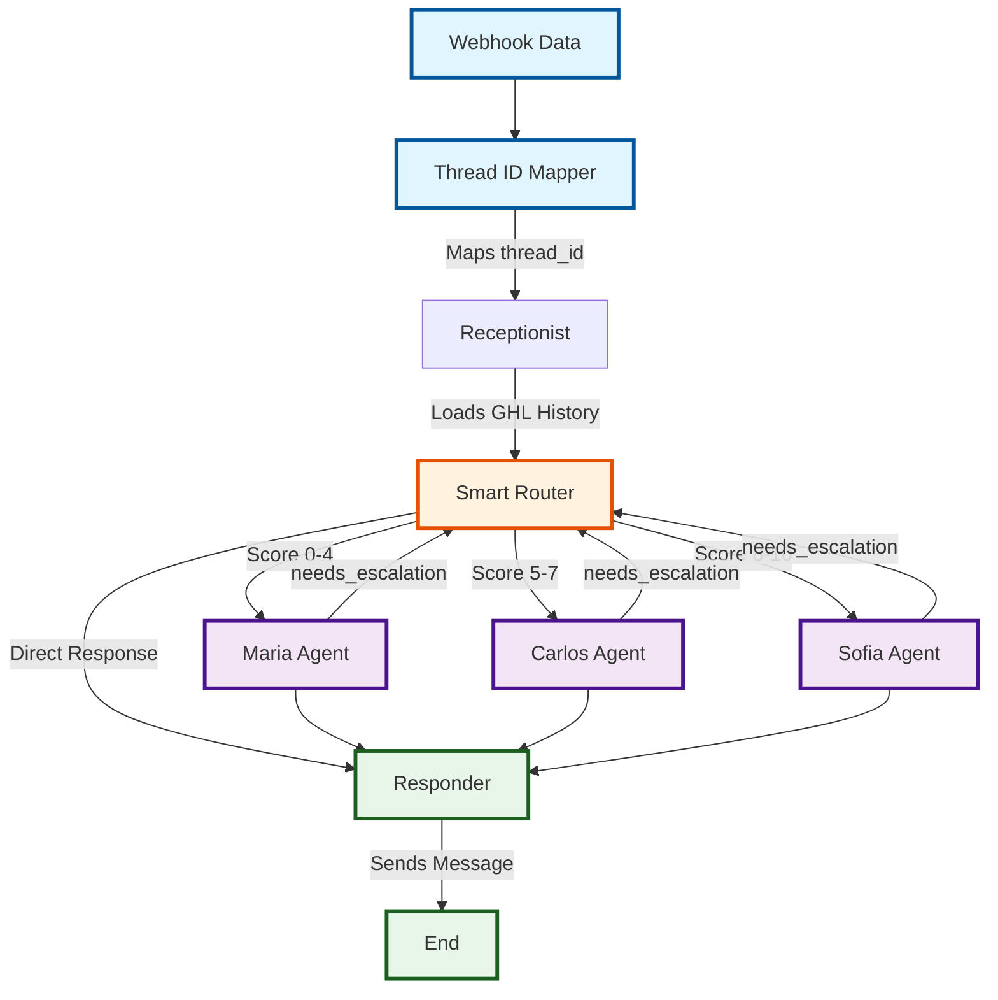
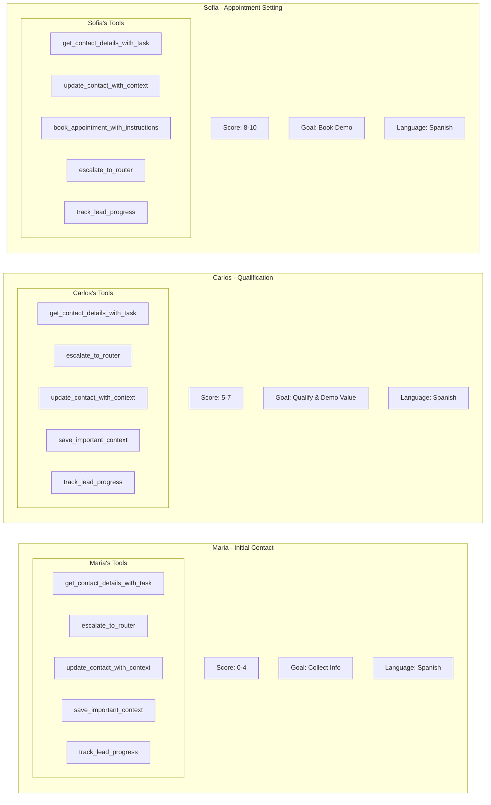
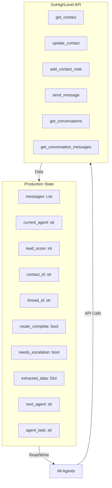
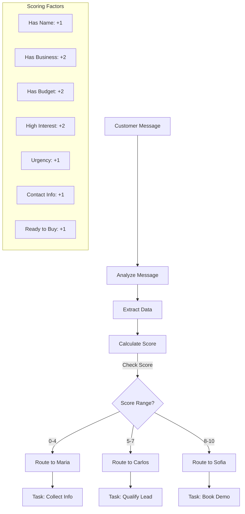
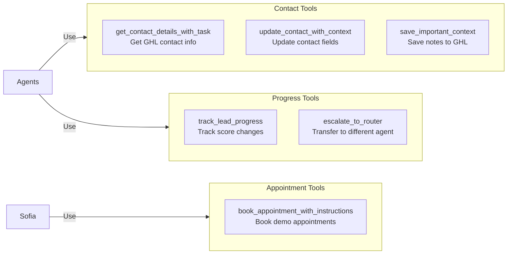
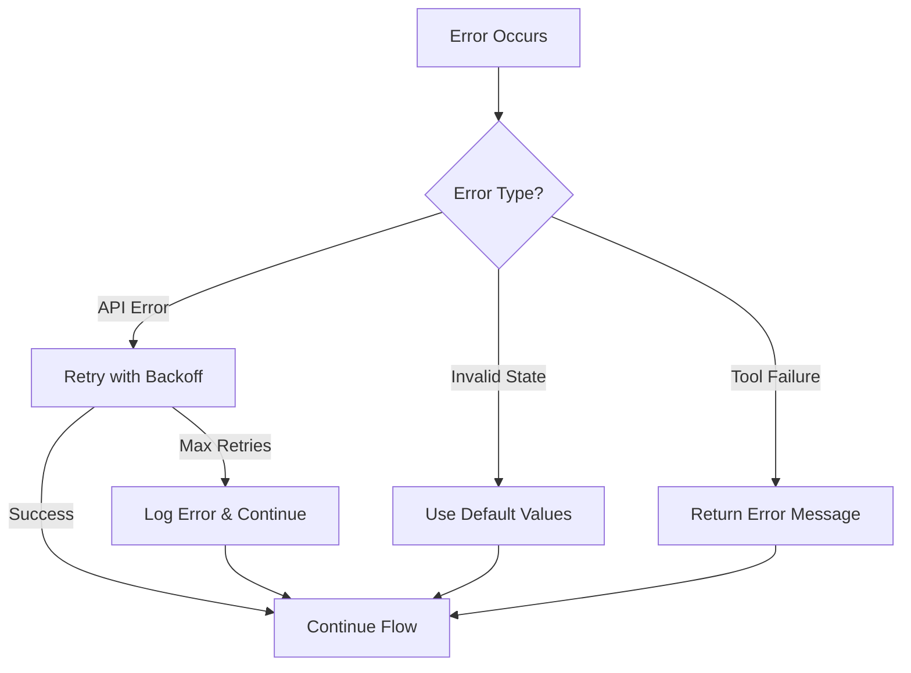

# LangGraph GHL Agent System Flow

## Complete System Architecture

## Agent Details and Tools

## Data Flow and State

## Smart Router Logic

## Tool Details

## Error Handling and Edge Cases

## Key Features

1. **Thread Management**: Each conversation gets a unique thread_id for persistence
2. **Message Deduplication**: Prevents duplicate messages with case-insensitive comparison
3. **Smart Routing**: Automatic agent selection based on lead score
4. **Tool Tracking**: All tool usage logged to LangSmith
5. **Error Recovery**: Graceful handling of API failures
6. **State Persistence**: Memory checkpoint for conversation continuity

## Workflow Rules

- **Maria** (Score 0-4): Initial contact, information gathering
- **Carlos** (Score 5-7): Qualification and value demonstration  
- **Sofia** (Score 8-10): Demo booking and closing
- **Responder**: Sends all agent messages via WhatsApp
- **Smart Router**: Analyzes messages and routes based on lead score

## Integration Points

- **GoHighLevel**: CRM and messaging platform
- **LangSmith**: Debugging and monitoring
- **OpenAI**: LLM for agents
- **WhatsApp**: Communication channel