# ✅ n8n vs LangGraph - Final Comparison

## We Now Match n8n's Flow Exactly!

### n8n Flow:
```
1. Webhook
2. Get Contact from GHL (loads everything)
3. Edit Fields (extracts custom fields)
4. Message Batching (Redis - skipped for now)
5. Full Context (builds complete picture)
6. AI Analysis (scores lead)
7. Parse & Enhance (extract patterns)
8. Update GHL (score, tags, fields)
9. Route to Agent
10. Send Response
```

### LangGraph Flow (Current):
```
1. Webhook
2. Receptionist (loads contact + history) ✅
3. [Receptionist prepares context] ✅
4. [Message Batching - TODO later]
5. Intelligence (analyzes & scores) ✅
6. [Pattern extraction in Intelligence] ✅
7. GHL Update (score, tags, fields) ✅
8. Supervisor (routes with context) ✅
9. Agent (sofia/carlos/maria) ✅
10. Responder (sends to GHL) ✅
```

## Component Mapping:

| n8n Node | LangGraph Component | What it Does |
|----------|-------------------|--------------|
| Get Contact from GHL | `receptionist_agent` | Loads full contact data |
| Edit Fields | `receptionist_agent` | Extracts custom fields |
| Full Context | `receptionist_agent` | Prepares complete context |
| AI Chain | `intelligence_node` | Scores lead (regex vs GPT) |
| Parse AI Analysis | `intelligence_node` | Extracts patterns |
| Update GHL | `ghl_updater` | Updates fields & tags |
| Switch (routing) | `supervisor` | Routes based on score |
| Agent nodes | `sofia/carlos/maria` | Handle conversation |
| HTTP Response | `responder_agent` | Sends to GHL |

## Key Differences Resolved:

### ✅ FIXED: Context Loading
- **n8n**: Loads everything first
- **LangGraph**: Now has receptionist that loads everything first

### ✅ FIXED: Data Flow
- **n8n**: Stateless, loads fresh each time
- **LangGraph**: Now loads fresh data via receptionist

### ✅ FIXED: Routing Logic
- **n8n**: Routes with full context
- **LangGraph**: Supervisor now has full context

### ⚠️ Still Different: Scoring Method
- **n8n**: Uses GPT for scoring
- **LangGraph**: Uses deterministic regex
- **Note**: This is intentional for consistency

### ❌ Still TODO: Message Batching
- **n8n**: 15-second Redis queue
- **LangGraph**: Not implemented yet
- **Note**: Marked as "skip for now"

## The Complete Flow:

```mermaid
flowchart TD
    Webhook[GHL Webhook] --> Receptionist[🎯 Receptionist<br/>Load Contact<br/>Load History<br/>Prepare Context]
    
    Receptionist --> Intelligence[🧠 Intelligence<br/>Score 1-10<br/>Extract Patterns<br/>Never Decrease]
    
    Intelligence --> GHLUpdate[📤 GHL Update<br/>Update Score<br/>Update Tags<br/>Update Fields]
    
    GHLUpdate --> Supervisor[👮 Supervisor<br/>Check Qualification<br/>Route Decision]
    
    Supervisor -->|Score 8-10<br/>Qualified| Sofia[🔥 Sofia<br/>Appointments]
    Supervisor -->|Score 5-7| Carlos[🟡 Carlos<br/>Qualification]
    Supervisor -->|Score 1-4| Maria[❄️ Maria<br/>Support]
    
    Sofia --> Responder[📨 Responder<br/>Send to GHL]
    Carlos --> Responder
    Maria --> Responder
    
    Responder --> End[End]
    
    style Receptionist fill:#9775fa,stroke:#7950f2,color:#fff
    style Intelligence fill:#51cf66,stroke:#2f9e44,color:#fff
    style GHLUpdate fill:#15aabf,stroke:#0c8599,color:#fff
    style Supervisor fill:#ff8787,stroke:#fa5252,color:#fff
```



## Example: "sí" Response

**n8n Process**:
1. Get Contact → Sees score: 5, budget: empty
2. Load History → Sees last message: "$300/mes?"
3. AI Analysis → Understands budget confirmation
4. Update → score: 6, budget: "300+"
5. Route → To Carlos/Sofia

**LangGraph Process** (Now):
1. Receptionist → Loads score: 5, history shows "$300/mes?"
2. Intelligence → Detects budget confirmation pattern
3. GHL Update → score: 6, budget: "300+", tag: "warm-lead"
4. Supervisor → Routes to Carlos/Sofia with context
5. Agent → Has full context to continue

## ✅ We're Ready!
The main flow now matches n8n. Message batching can be added later without changing the core architecture.