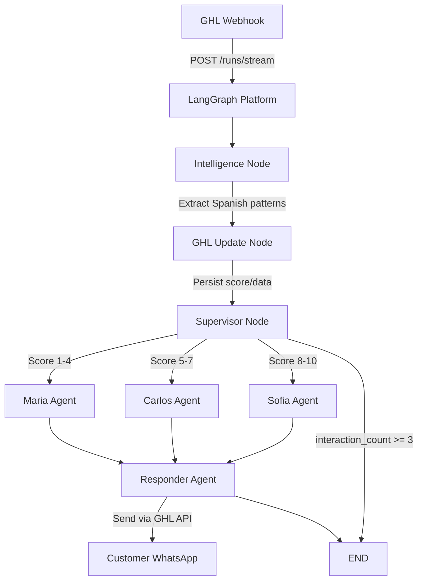

# 🏗️ FINAL SYSTEM ARCHITECTURE

## Complete Flow Diagram



## Node Responsibilities

### 1. Intelligence Node (`intelligence_node`)
- **Input**: Raw message from customer
- **Process**: 
  - Spanish pattern extraction (regex-based)
  - Lead scoring (1-10 scale)
  - Budget detection
  - Goal extraction
- **Output**: Enriched state with score and extracted data

### 2. GHL Update Node (`ghl_update_node`)
- **Input**: State with intelligence analysis
- **Process**:
  - Update GHL custom fields
  - Add tags based on score
  - Persist all extracted data
- **Output**: State (pass-through)

### 3. Supervisor Node (`supervisor_with_safety`)
- **Input**: Enriched state
- **Process**:
  - Check safety limits (max 3 interactions)
  - Route based on lead score
  - Handle errors gracefully
- **Output**: Routing decision + interaction count

### 4. Agent Nodes
#### Maria (`maria_with_message_format`)
- **Role**: Cold leads, customer support
- **Tools**: Transfer to other agents, save context
- **Output**: AI response messages

#### Carlos (`carlos_with_message_format`)
- **Role**: Warm leads, qualification
- **Tools**: Transfer to Sofia/Maria, qualify lead
- **Output**: AI response messages

#### Sofia (`sofia_with_message_format`)
- **Role**: Hot leads, appointment booking
- **Tools**: Book appointments, transfer if needed
- **Output**: AI response messages + appointment confirmation

### 5. Responder Node (`responder_node`)
- **Input**: State with AI messages
- **Process**:
  - Filter unsent messages
  - Send via GHL API
  - Add natural delays
  - Track sent messages
- **Output**: Update response_sent flag

## State Management

```python
ConversationState:
    # Messages
    messages: Annotated[List[BaseMessage], add_messages]  # Thread-safe
    contact_id: Annotated[str, lambda x, y: y if y else x]  # Parallel-safe
    
    # Lead info
    lead_score: int (1-10)
    route: Literal["cold", "warm", "hot"]
    
    # Loop prevention
    interaction_count: int  # Max 3
    response_sent: bool     # Prevents re-sending
    should_end: bool        # Explicit end
    
    # Intelligence results
    extracted_data: Dict[str, Any]
    score_reasoning: str
```

## Safety Mechanisms

### 1. Loop Prevention
- Max 3 agent interactions per conversation
- Agents don't route back to supervisor
- Responder always ends workflow

### 2. Error Handling
- Try/catch in every node
- Fallback to Maria on errors
- Graceful error messages to customer

### 3. Message Delivery
- Retry logic in GHL client (5 attempts)
- Exponential backoff for rate limits
- Message chunking for WhatsApp limits

### 4. State Consistency
- Annotated fields for parallel safety
- Message deduplication
- Persistent checkpointing

## Integration Points

### GHL → System
1. **Webhook Format**:
```json
{
  "assistant_id": "agent",
  "input": {
    "messages": [{"role": "user", "content": "{{message.body}}"}],
    "contact_id": "{{contact.id}}"
  }
}
```

2. **Custom Fields Read**:
- Previous score
- Business info
- Contact details

### System → GHL
1. **Message Sending**:
```python
ghl_client.send_message(
    contact_id=contact_id,
    message=content,
    message_type="WhatsApp"
)
```

2. **Field Updates**:
```python
ghl_client.update_custom_fields(
    contact_id=contact_id,
    custom_fields={
        "score_field_id": score,
        "business_field_id": business
    }
)
```

3. **Appointment Booking**:
```python
ghl_client.create_appointment(
    contact_id=contact_id,
    start_time=start_dt,
    end_time=end_dt,
    title="Consultation"
)
```

## Performance Optimizations

1. **Caching**: 
   - Regex patterns compiled once
   - LRU cache for repeated operations

2. **Parallel Capability**:
   - State supports concurrent updates
   - Python 3.13 free-threading ready

3. **Token Optimization**:
   - Message trimming for context
   - Efficient prompts

4. **Monitoring**:
   - LangSmith tracing
   - Performance metrics endpoint

## Deployment Configuration

### langgraph.json
```json
{
  "name": "ghl-langgraph-agent",
  "version": "1.0.2",
  "graphs": {
    "agent": "./app/workflow.py:workflow"
  },
  "python_version": "3.13"
}
```

### Environment Variables
- API Keys: OpenAI, GHL, Supabase, LangSmith
- GHL IDs: Location, Calendar, User
- Custom Field Mappings
- Feature Flags

## Success Metrics

1. **Response Time**: < 10 seconds
2. **Message Delivery**: 95%+ success rate
3. **Lead Routing**: Accurate based on score
4. **Cost**: < $0.10 per conversation
5. **Error Rate**: < 5%

## Failure Modes & Recovery

1. **GHL API Down**:
   - Messages queued in Supabase
   - Retry on recovery

2. **OpenAI API Issues**:
   - Fallback responses
   - Graceful degradation

3. **Rate Limits**:
   - Exponential backoff
   - Request throttling

4. **Invalid State**:
   - Reset to safe defaults
   - Log for debugging

---

**This architecture ensures reliable, cost-effective, and scalable operation of the GHL messaging agent.**