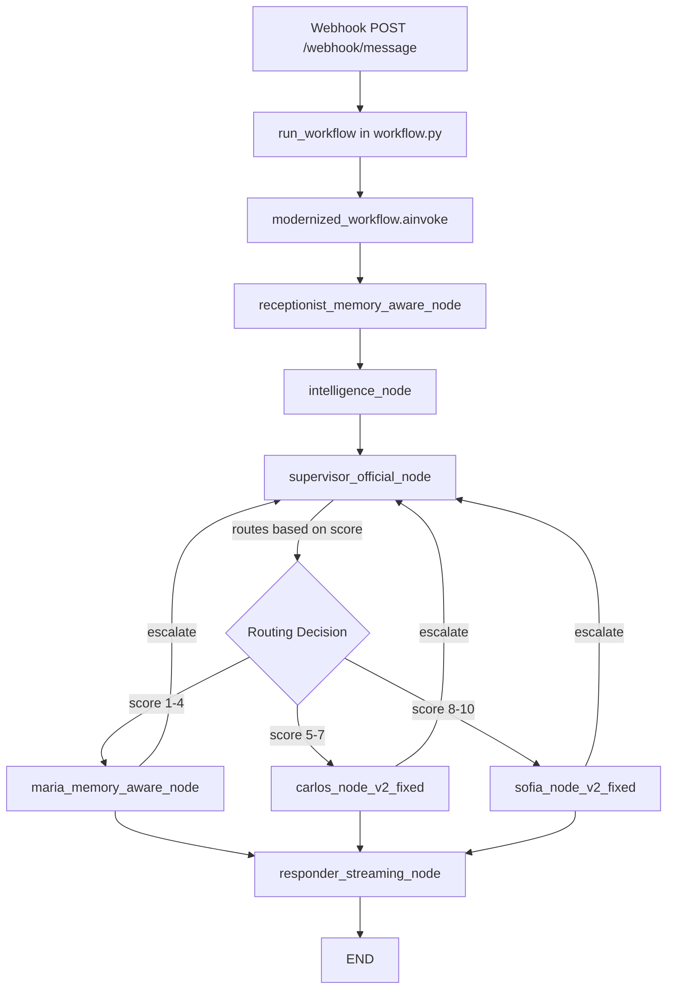

# Production Execution Flow Analysis

## 🎯 EXACT CODE RUNNING IN PRODUCTION (v3.1.1)

### Entry Point Flow
```
1. app.py
   └─> app.api.webhook_simple.py (FastAPI app)
       └─> POST /webhook/message endpoint
           └─> app.workflow.run_workflow()
               └─> app.workflow_modernized.modernized_workflow
```

## 📊 Complete Execution Flow Diagram



## 🗂️ PRODUCTION FILES IN USE

### 1. **Workflow Orchestration**
- **ACTIVE**: `app/workflow_modernized.py` - The REAL production workflow
- **WRAPPER**: `app/workflow.py` - Just imports modernized_workflow
- **DEAD CODE**: All other workflow_*.py files

### 2. **Agent Files Being Used**
- **Receptionist**: `app/agents/receptionist_memory_aware.py`
- **Supervisor**: `app/agents/supervisor_official.py` 
- **Maria**: `app/agents/maria_memory_aware.py`
- **Carlos**: `app/agents/carlos_agent_v2_fixed.py`
- **Sofia**: `app/agents/sofia_agent_v2_fixed.py`
- **Responder**: `app/agents/responder_streaming.py`

### 3. **Intelligence/Analysis**
- **ACTIVE**: `app/intelligence/analyzer.py` - Used by intelligence_node
- **DEAD CODE**: `ai_analyzer.py`, `supervisor_brain.py`, etc.

### 4. **Tools in Use**
- **ACTIVE**: `app/tools/agent_tools_modernized.py` - Used by agents
- Components: `escalate_to_supervisor`, `get_contact_details_with_task`, `update_contact_with_context`, `book_appointment_with_instructions`

## 📋 Node Execution Order

1. **receptionist_memory_aware_node**
   - Loads contact data from GHL
   - Extracts conversation history
   - Prepares initial state

2. **intelligence_node** (from analyzer.py)
   - Spanish pattern extraction
   - Lead scoring (1-10)
   - Budget detection
   - Updates extracted_data

3. **supervisor_official_node**
   - Uses handoff tools with task descriptions
   - Routes based on lead score
   - Creates Command objects

4. **Agent Nodes** (one of):
   - maria_memory_aware_node (cold leads)
   - carlos_node_v2_fixed (warm leads)
   - sofia_node_v2_fixed (hot leads)

5. **responder_streaming_node**
   - Sends final message to customer
   - Uses human-like timing delays

## 🚫 DEAD CODE (Not in Production)

### Unused Workflows
- workflow_v2.py
- workflow_supervisor_brain.py
- workflow_with_receptionist.py
- workflow_parallel.py
- workflow_linear.py
- workflow_optimized.py
- workflow_memory_optimized.py (was replaced by modernized)
- workflow_simplified.py

### Unused Agent Versions
- maria_agent.py, maria_agent_v2.py, maria_agent_v3.py
- carlos_agent.py, carlos_agent_v2.py, carlos_agent_v3.py
- sofia_agent.py, sofia_agent_v2.py, sofia_agent_v3.py
- All *_enhanced.py versions

### Unused Intelligence
- ai_analyzer.py
- supervisor_brain.py
- supervisor_brain_enhanced.py
- supervisor_brain_with_ai.py

## ✅ CONFIRMED PRODUCTION FEATURES

1. **Modernized Supervisor Pattern**
   - Uses create_react_agent
   - Handoff tools with InjectedToolCallId
   - Task descriptions in handoffs

2. **Command Pattern**
   - All tools return Command objects
   - Task context via agent_task field

3. **Memory-Aware Agents**
   - Isolated memory contexts
   - Sliding window for messages

4. **Health Endpoints**
   - /health, /metrics, /ok active

## 🔍 Key Import Chain

```
app.py
├── app/api/webhook_simple.py
│   └── app/workflow.py (run_workflow)
│       └── app/workflow_modernized.py (modernized_workflow)
│           ├── app/agents/receptionist_memory_aware.py
│           ├── app/agents/supervisor_official.py
│           ├── app/agents/maria_memory_aware.py
│           ├── app/agents/carlos_agent_v2_fixed.py
│           ├── app/agents/sofia_agent_v2_fixed.py
│           ├── app/agents/responder_streaming.py
│           └── app/intelligence/analyzer.py
```

## 📝 Summary

The REAL production workflow is `workflow_modernized.py` which orchestrates:
- Memory-aware receptionist
- Intelligence analyzer for scoring
- Official supervisor with handoff tools
- Three fixed agent versions (maria_memory_aware, carlos_v2_fixed, sofia_v2_fixed)
- Streaming responder with human-like delays

Everything else is legacy code that should be cleaned up.